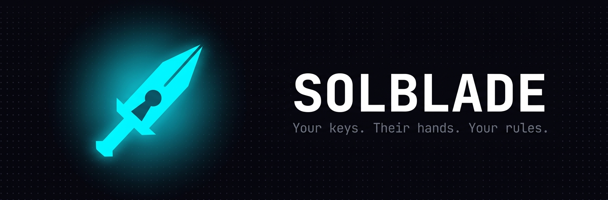
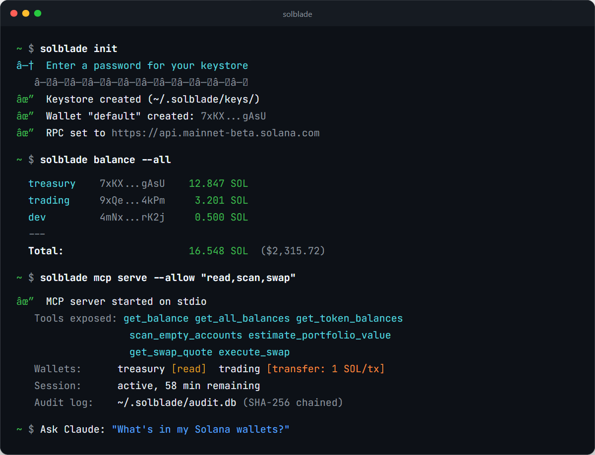

<p align="center">
  
</p>

<p align="center">
  <strong>AI-native Solana wallet CLI with scoped MCP server</strong><br/>
  Your keys. Their hands. Your rules.
</p>

<p align="center">
  <a href="https://github.com/nullxnothing/solblade/actions/workflows/ci.yml"></a>
  <a href="https://opensource.org/licenses/MIT"></a>
  <a href="https://bun.sh"></a>
  <a href="https://modelcontextprotocol.io"></a>
  <a href="https://github.com/nullxnothing/solblade/stargazers"></a>
</p>

<p align="center">
  <a href="#install">Install</a> &bull;
  <a href="#connect-to-your-ai">Connect to your AI</a> &bull;
  <a href="#mcp-tools">MCP Tools</a> &bull;
  <a href="#security-model">Security</a> &bull;
  <a href="#cli-commands">CLI Commands</a> &bull;
  <a href="#architecture">Architecture</a>
</p>

---

<p align="center">
  
</p>

---

Solblade is a Solana wallet that runs in your terminal and exposes a [Model Context Protocol](https://modelcontextprotocol.io) (MCP) server so AI agents can manage your wallets — with granular, per-wallet permission scoping you control.

No browser extensions. No custodial APIs. Just a CLI with an encrypted local keystore and an MCP interface that gives AI exactly the access you choose: read-only portfolio views, spend-limited transfers, or full autonomy within guardrails.

## Why Solblade

AI agents need wallet access to be useful on-chain, but giving an AI your private key is insane — and read-only access is useless for real work.

Solblade sits between your keys and the AI. You set per-wallet access levels, spend limits, rate limits, and destination allowlists. The AI operates within those bounds. Every action is logged in a tamper-evident audit chain. Revoke access with one command.

- **CLI-native MCP server** — no web app, no browser extension, just `solblade mcp serve`
- **Per-wallet AI permissions** — each wallet has its own access level and spend limits
- **Confirmation gates** — require human approval for transfers, or auto-execute under limits
- **Rent reclaim engine** — AI scans for dead token accounts and reclaims locked SOL in bulk
- **Tamper-evident audit log** — SHA-256 chained event log of every AI action
- **Encrypted local keystore** — AES-256-GCM with PBKDF2 key derivation, keys never leave your machine

---

## Install

```bash
# requires Bun (https://bun.sh)
bun install -g solblade

# initialize keystore, first wallet, and RPC config
solblade init
```

---

## Connect to your AI

Solblade works with any MCP-compatible client. Pick your editor below.

> **Tip:** Replace `"*"` with specific tool groups to restrict access — `"read"` for read-only, `"read,scan,cleanup"` for read + rent reclaim.

<details>
<summary><strong>Claude Code</strong></summary>

```bash
claude mcp add solblade -- bunx solblade mcp serve --allow "*"
```

That's it. One command.

</details>

<details>
<summary><strong>Claude Desktop</strong></summary>

Add to your config file:
- **macOS:** `~/Library/Application Support/Claude/claude_desktop_config.json`
- **Windows:** `%APPDATA%\Claude\claude_desktop_config.json`

```json
{
  "mcpServers": {
    "solblade": {
      "command": "bunx",
      "args": ["solblade", "mcp", "serve", "--allow", "*"]
    }
  }
}
```

Restart Claude Desktop after saving.

</details>

<details>
<summary><strong>Cursor</strong></summary>

Add to `.cursor/mcp.json` in your project root, or go to **Settings > MCP Servers > Add Server**:

```json
{
  "mcpServers": {
    "solblade": {
      "command": "bunx",
      "args": ["solblade", "mcp", "serve", "--allow", "*"]
    }
  }
}
```

</details>

<details>
<summary><strong>VS Code / GitHub Copilot</strong></summary>

Add to `.vscode/mcp.json` in your workspace:

```json
{
  "servers": {
    "solblade": {
      "command": "bunx",
      "args": ["solblade", "mcp", "serve", "--allow", "*"]
    }
  }
}
```

Or open the Command Palette (`Ctrl+Shift+P`) and run **MCP: Add Server**.

</details>

<details>
<summary><strong>Windsurf</strong></summary>

Add to `~/.codeium/windsurf/mcp_config.json`:

```json
{
  "mcpServers": {
    "solblade": {
      "command": "bunx",
      "args": ["solblade", "mcp", "serve", "--allow", "*"]
    }
  }
}
```

</details>

<details>
<summary><strong>Zed</strong></summary>

Add to Zed settings (`settings.json`):

```json
{
  "context_servers": {
    "solblade": {
      "command": {
        "path": "bunx",
        "args": ["solblade", "mcp", "serve", "--allow", "*"]
      }
    }
  }
}
```

</details>

<details>
<summary><strong>Any MCP Client (stdio)</strong></summary>

Solblade speaks MCP over stdio. Point any compatible client at:

```bash
bunx solblade mcp serve --allow "*"
```

</details>

---

## MCP Tools

Once connected, your AI agent has access to these tool groups:

| Group | Tools | What it does |
|-------|-------|--------------|
| **balance** | `get_balance` `get_all_balances` `get_token_balances` | SOL and token balance queries |
| **wallets** | `list_wallets` `get_wallet_permissions` | Wallet metadata and AI access levels |
| **price** | `get_token_price` | USD prices via Jupiter/Birdeye |
| **swap** | `get_swap_quote` `execute_swap` | Jupiter DEX quotes and execution |
| **transfer** | `send_sol` `send_token` | SOL and SPL token transfers |
| **scan** | `scan_empty_accounts` `scan_all_wallets` `estimate_portfolio_value` | Rent reclaim scanning, portfolio valuation |
| **cleanup** | `close_token_account` `close_token_accounts_bulk` | Close dead token accounts, reclaim rent |
| **history** | `get_transaction_history` `get_account_info` | On-chain transaction and account data |
| **log** | `get_audit_log` `get_spend_summary` | AI action history and spend tracking |
| **admin** | `get_session_status` | Session and permission introspection |

### Permission Scoping

Every wallet has independent AI access controls:

```bash
# Read-only access
solblade wallet ai-access treasury --level read

# Transfer access with spend limits (SOL)
solblade wallet ai-access trading --level transfer --per-tx 1 --per-session 5

# Require human confirmation for each transfer
solblade wallet set-confirm trading --on

# Restrict destinations to trusted addresses
solblade wallet set-allowlist trading --add <trusted-pubkey>
```

### Confirmation Flow

When `require_confirmation` is enabled, write tools return a pending action instead of executing:

```
AI:  "I'd like to send 0.5 SOL from 'trading' to 9xQe...4kPm ($75.00).
      This is within your 1 SOL per-transaction limit. Approve?"
You: "Yes"
AI:  "Done — tx confirmed: 5Uj8... (explorer link)"
```

---

## Security Model

```
┌─ Tool Allowlist ────────── which tools are exposed at all
├─ Wallet AI Access ──────── none / read / transfer per wallet
├─ Session Gate ──────────── password-derived key, configurable TTL
├─ Spend Limits ──────────── per-tx and per-session caps in SOL
├─ Rate Limits ───────────── max transactions per minute
├─ Destination Allowlist ─── restrict where funds can go
├─ Confirmation Gate ─────── human approval before execution
├─ Transaction Simulation ── Solana RPC simulation before signing
└─ Tamper-Evident Audit ──── SHA-256 chained event log
```

**Never exposed via MCP:** private key export, seed phrases, keystore files, password/session material, permission escalation, wallet creation/deletion, RPC config changes.

---

## CLI Commands

### Wallet Management
```bash
solblade create [--label name] [--group name]     # Create new wallet
solblade import --key <base58>                     # Import existing key
solblade list [--group name] [--tag name]          # List wallets
solblade label <wallet> --set <name>               # Rename wallet
solblade default <wallet>                          # Set default wallet
solblade remove <wallet>                           # Archive wallet
```

### Transactions
```bash
solblade balance [wallet]                          # SOL balance
solblade balance --all                             # All wallet balances
solblade balance --tokens [wallet]                 # SPL token balances
solblade send <amount> SOL --to <address>          # Send SOL
solblade send <amount> <token> --to <address>      # Send SPL token
solblade swap <amount> <token> --to <token>        # Jupiter swap
```

### Session & Security
```bash
solblade unlock                                    # Start session
solblade lock                                      # End session
solblade unlock --status                           # Check session
```

### MCP Server
```bash
solblade mcp serve [--allow <tools>]               # Start MCP stdio server
```

### Audit
```bash
solblade log [--limit N]                           # View audit log
```

---

## Architecture

| Component | Stack |
|-----------|-------|
| Runtime | [Bun](https://bun.sh) with native SQLite |
| Encryption | AES-256-GCM, PBKDF2-SHA256 (600k iterations) |
| Database | SQLite with WAL mode |
| MCP | `@modelcontextprotocol/sdk` over stdio |
| Solana | `@solana/web3.js` v1.x + `@solana/spl-token` v0.4 |
| DEX | Jupiter V6 API |
| Keystore | `~/.solblade/keys/*.enc` (one encrypted file per wallet) |

See [`docs/MCP_ARCHITECTURE.md`](docs/MCP_ARCHITECTURE.md) for the full MCP server design.

---

## Development

```bash
git clone https://github.com/nullxnothing/solblade.git
cd solblade
bun install
bun run dev
```

## License

MIT

---

<p align="center">
  
</p>
